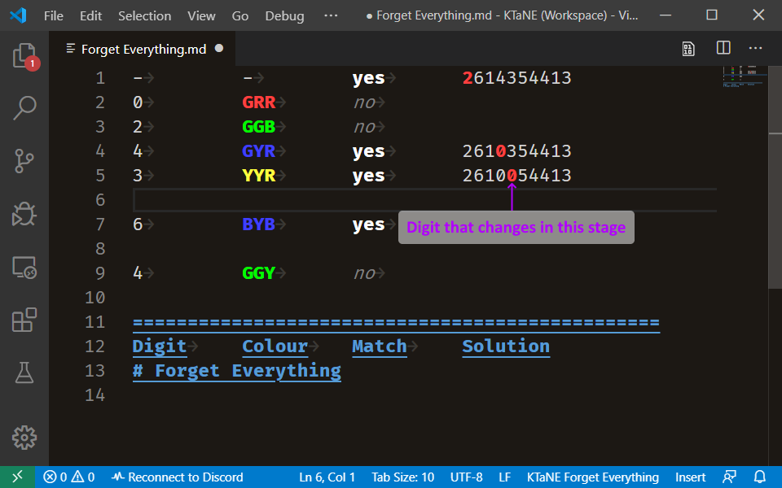

# Forget Everything

This page is used to record information from a Forget Everything module. In the case of multiple Forget Everything modules, create a new document and select the _KTaNE Forget Everything_ grammar for it. You may copy the template into it.

The Forget Everything template table has headers at the bottom of the file. This is to easily enable use of the `Ctrl`+`G` shortcut to go to the line number for any stage.

For each stage, the solution digit that should change is highlighted, and the stage colour is shown. If you already know the stage colour, you may also write the full word.

