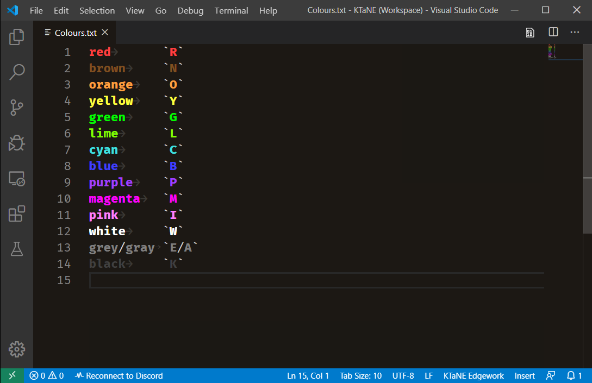

# Main Page

This page is used to record edgework and general-purpose note-taking. Edgework should be filled out as shown, except that indicators and ports may be in either order. It will be highlighted as shown in the figure below.

Additional pages are provided for specific modules in the Modules directory. Some of them come with special syntax highlighting grammars, including Forget Me Not shown.

Recognised colour names will be highlighted. By default, they will be highlighted if spelled out as full words. You can enclose a block in backticks in order to also highlight abbreviation letters in uppercase, as shown in the figure below.

This highlighting may be applied to other files by selecting the _KTaNE Edgework grammar_.

