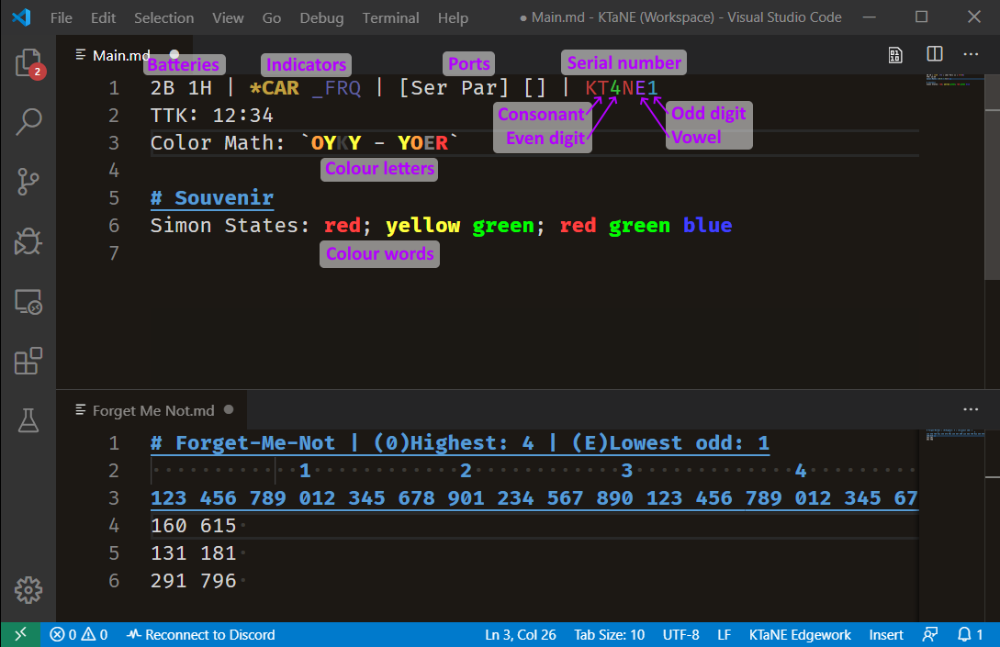

# Keep Talking and Nobody Explodes Workspace for Visual Studio Code

This is a workspace and extension for  optimised for experting in the game _Keep Talking and Nobody Explodes_. Templates and special syntax highlighting grammars are included for certain puzzles.

The main page, Main.md, is for edgework and general-purpose note-taking, while the Modules directory contains templates for specific modules. All of these files should be read-only.

The ktane-highlights directory is a Visual Studio Code extension. To install the extension, copy the directory into `$HOME/.vscode/extensions` (or create a symbolic link), then restart Code.

